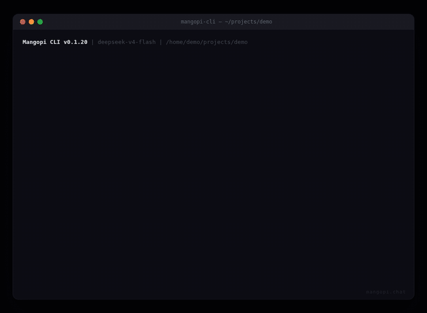

# Mangopi CLI

<p>
<a href="https://github.com/w4n9H/mangopi-cli/actions/workflows/ci.yml"></a>
<a href="https://pypi.org/project/mangopi-cli/"></a>
<a href="https://pypi.org/project/mangopi-cli/"></a>
<a href="https://github.com/w4n9H/mangopi-cli/blob/main/LICENSE"></a>
<br>
<a href="https://github.com/w4n9H/mangopi-cli/stargazers"></a>
<a href="https://github.com/w4n9H/mangopi-cli/releases"></a>
<a href="https://pepy.tech/project/mangopi-cli"></a>
<a href="https://github.com/w4n9H/mangopi-cli/commits/main"></a>
</p>



> Single-file, zero-dependency AI coding assistant for the terminal.

Mangopi CLI is a local-first autonomous coding agent built with only the Python standard library.

No frameworks.
No Electron.
No Docker.
No dependency hell.

Just one fast, hackable Python file.

---

# Design Philosophy

**Seeking a perfect balance between code size, complexity, and the functionality & effectiveness of the agent.**

Mangopi CLI intentionally keeps the runtime extremely small.

Why?

* easier to audit 
* easier to hack 
* easier to fork 
* easier to understand 
* easier to run locally

The project avoids unnecessary abstractions, frameworks, and dependencies whenever possible.

---

# Why Mangopi CLI?

| Mangopi CLI                  | Typical AI Agent Frameworks  |
|------------------------------|------------------------------|
| Single-file runtime          | Large multi-module codebases |
| Python standard library only | Heavy dependency trees       |
| Instant startup              | Slow boot time               |
| Fully hackable               | Framework-heavy              |
| Local-first                  | Cloud-oriented               |
| Minimal abstractions         | Over-engineered              |
| Easy to fork                 | Hard to customize            |


---


# Ideal For

* developers who prefer terminal workflows 
* users who dislike heavyweight AI frameworks 
* hackers and tinkerers 
* local-first enthusiasts 
* people who want full runtime control 
* building custom coding agents

---

# Features

* Single-file architecture
* Python standard library only
* Instant startup speed
* Local-first workflow design
* Autonomous loop execution (multi-agent implement / verify / refine pipeline)
* ACP agent server (`--acp`) — Agent Client Protocol v1 over stdio, connectable from Zed / JetBrains etc.
* Smart provider routing with tiered models (high/medium/low)
* Multimodal support (image reading via `view_image`)
* Web search via Bocha AI Search (`web_search` tool)
* Context-aware conversation management
* Automatic context compacting
* OpenAI-compatible API support
* Built-in file and shell tools
* Persistent local sessions
* Skill system support (`SKILL.md`)
* Extension system — auto-discovered custom tools via `~/.mangocli/extensions/*.py`
* Safe shell execution checks
* Fully hackable and easy to extend
* Large-context optimized runtime

---

# Installation

## From PyPI

```bash
pip install mangopi-cli
```

Start Mangopi CLI:

```bash
mangopi-cli
```

---

## From Source

```bash
git clone git@github.com:w4n9H/mangopi-cli.git
cd mangopi-cli
python mangopi_cli.py
```

---

# Configuration

Required:

```bash
export MANGO_KEY="your_api_key"
```

Recommended:

```bash
export MANGO_API_URL="https://api.deepseek.com"
export MANGO_MODEL="deepseek-v4-flash"
```

Optional:

```bash
export MANGO_MAX_CONTEXT=1000000   # default 1,000,000 tokens
export MANGO_LANG=en               # en (default) | zh — controls UI text and CLI help language
```

---


# Smart Provider Routing

Enable multi-model routing with the `MANGO_ROUTING` env var:

```bash
export MANGO_ROUTING=on
```

Define providers in `.mangocli/providers.json` (tiers: low/medium/high):

```json
{
  "providers": [
    {"name": "low",    "url": "https://api.deepseek.com", "model": "deepseek-v4-flash",    "tier": "low",    "api_key": "sk-xxx"},
    {"name": "medium", "url": "https://api.deepseek.com", "model": "deepseek-v4",          "tier": "medium", "api_key": "sk-xxx"},
    {"name": "high",   "url": "https://api.deepseek.com", "model": "deepseek-v4-reasoning", "tier": "high",   "api_key": "sk-xxx"}
  ],
  "routing": {
    "default_tier": "medium",
    "score_thresholds": {"low_max": 3, "medium_max": 7}
  }
}
```

Mangopi CLI auto-selects the appropriate tier based on task complexity — keyword matching + LLM scoring. Each turn uses one model; no mid-loop switching. A sample config is at `providers.json.example`.

---

# Supported Providers

Mangopi CLI supports:

* DeepSeek
* OpenAI-compatible APIs
* MiniMax
* Custom compatible endpoints

Example:

```bash
export MANGO_API_URL="https://api.openai.com/v1"
export MANGO_MODEL="gpt-4o-mini"
```

---

# Usage

Start the CLI:

```bash
mangopi-cli
```

or:

```bash
python mangopi_cli.py
```

---

# Built-in Commands

| Command     | Aliases         | Description                                              |
|-------------|-----------------|----------------------------------------------------------|
| `/q`        | `/quit`         | Quit                                                     |
| `/n`        | `/new`          | Start a new session (old session is auto-backed-up)      |
| `/c`        | `/compact`      | Manually trigger full conversation compact               |
| `/h`        | `/help`         | Show built-in command help                               |
| `/l <goal>` | `/loop <query>` | Start Loop Engineering — configurable pipeline with optional modes |

`/loop` runs up to 5 iterations; the pipeline short-circuits on the first `VERIFY: PASS`.

| Flag | Description |
|------|-------------|
| `--fast` | Skip design/review, only dev → test → push |
| `--only-dev` | Dev only: no test/review, dev → push/succeed |
| `--wish` | Prepend research (`web_search`) before the pipeline |
| `--dry-run` | Print pipeline topology and exit |
| `--push` | Commit verified changes on PASS |
| `--task-id <id>` | Assign a persistent task ID (for resume) |
| `--acp` | Run as ACP (Agent Client Protocol) v1 agent server over stdio (JSON-RPC) |

---

# Loop Engineering

Loop Engineering replaces the legacy Goal Mode with a **configurable Step/Pipeline**:

| Agent | Role |
|-------|------|
| **ResearchAgent** | Optional (`--wish`). Gathers information via `web_search`; independent ctx. |
| **DesignAgent** | Reads code, plans the design; shares `impl_ctx` with DevAgent. |
| **DevAgent** | Implements progressively, extracts changed files for downstream agents. |
| **ReviewAgent** | Inspects `git diff`, returns `VERIFY: PASS/FAIL`; independent ctx. |
| **TestAgent** | Runs tests, judges PASS/FAIL; independent ctx. |
| **UpdaterAgent** | On failure, refines the prompt for the next iteration; read/grep only. |

**Modes:**

| Mode | Pipeline | Command |
|------|----------|---------|
| Normal | `DesignAgent → DevAgent → ReviewAgent → TestAgent → SucceedStep / UpdaterAgent` | `/loop <goal>` |
| Fast | `DevAgent → TestAgent → PushAgent / UpdaterAgent` | `/loop <goal> --fast` |
| Wish | `ResearchAgent → DesignAgent → DevAgent → ReviewAgent → TestAgent → …` | `/loop <goal> --wish` |

The pipeline runs up to 5 iterations, short-circuiting on the first `VERIFY: PASS`. All agents return structured results via `attempt_completion`.

## ACP Agent Server (`--acp`)

Run mangopi as an **Agent Client Protocol v1** agent over stdio — a resident JSON-RPC server that ACP-capable editors (Zed, JetBrains, codecompanion.nvim, etc.) can launch as a subprocess:

```bash
mangopi-cli --acp
```

The client drives the conversation via `session/new` + `session/prompt` messages; mangopi executes tools locally, streams progress via `session/update` notifications, and asks for permission through `session/request_permission` (rendered as a client-side prompt). One `session/prompt` = one turn; `session/cancel` ends the current turn.

# Built-in Tools

| Tool                 | Description                                                       |
|----------------------|-------------------------------------------------------------------|
| `read`               | Read a file or image (png/jpg/gif/webp auto-routed to vision)  |
| `write`              | Write or overwrite a file                                       |
| `edit`               | Replace an exact string in a file, with unified-diff preview    |
| `search`             | Search files using glob patterns, sorted by mtime               |
| `grep`               | Recursive regex content search                                  |
| `bash`               | Execute a shell command (60s timeout, output filtered)          |
| `view_image`         | Load a local image into the model's vision context              |
| `web_search`         | Search the live web via Bocha AI Search API                     |
| `use_skill`          | Load an installed `SKILL.md` with its scripts/references        |
| `loop_engine`       | Pipeline: design → dev → review → test (invoked via `/loop`) |
| `attempt_completion` | Final step — present the result to the user                     |

Mangopi CLI can autonomously inspect files, modify code, search projects, and execute shell commands.

---

# Skill System

Mangopi CLI supports reusable workflow skills.

Example structure:

```text
~/.mangocli/skills/python_backend/

├── SKILL.md
├── scripts/
└── references/
```

Example `SKILL.md`:

```md
---
description: Python backend workflow
tags: ["python", "backend"]
---

Use pytest for tests.
Prefer small functions.
```

The model can automatically discover and load relevant skills during execution.

---

# Extension System

Mangopi CLI supports custom tools via auto-discovered extensions: drop a Python file into `~/.mangocli/extensions/` and its tools join the built-in registry on startup — visible in the LLM tool schema, dispatched through `run_tool`, and available in ACP mode.

Example extension:

```python
# ~/.mangocli/extensions/hello.py
from mangopi_cli import ToolBase

class HelloTool(ToolBase):
    name = "hello"
    description = "Say hello"
    params = {"name": {"type": "string", "description": "Who to greet"}}

    def run(self, args):
        return self.ok("Hello, %s!" % args.get("name", "world"))

tools = [HelloTool()]
```

Conventions:

- An extension file exports a `tools` list of `ToolBase` instances
- Same-name tools override built-ins (extension wins)
- Extensions run arbitrary Python code — only install from trusted sources
- A runnable example lives at `examples/extensions/hello.py`

---

# Session Persistence

Sessions are stored locally:

```text
.mangocli/session/session.json
```

Mangopi CLI automatically:

* restores previous sessions
* preserves important context
* compacts old conversations
* manages long-running workflows

---

# Context Compacting

Mangopi CLI uses a **three-tier compacting strategy** that triggers automatically once context exceeds 80% of `MANGO_MAX_CONTEXT`:

| Tier                  | Strategy              | Scope                                                   |
|-----------------------|-----------------------|---------------------------------------------------------|
| `micro_compact`       | Head/tail truncation  | Individual tool outputs and long assistant messages     |
| `session_memory_compact` | Force-compact old turns | Drops the oldest turns, keeps last 10 turns in full |
| `compact_conversation`   | Drop-while-overflow  | Strips oldest turns first, then trims recent turns     |
| `full_compact`        | LLM-driven summary    | Replaces the whole conversation with a structured recap (manual `/c`) |

The compact pipeline is invoked by `ContextManager.prepare_for_api()` before every model call, so long-running autonomous workflows stay within the configured context budget without manual intervention.

---

# Safety

Mangopi CLI enforces safety at two layers:

**Dangerous command detection** — the following patterns require explicit `y/n` confirmation before execution:

* File deletion — `rm -rf`, `unlink`
* Disk / partition — `mkfs`, `fdisk`, `parted`, `dd if=... of=...`
* Permission changes — `chmod 777` (and similar `*7*7*` modes), `chown ... root`
* Privilege escalation — `sudo rm`, `su -`, `su root`
* Dangerous process control — `kill -9 1`, `killall -9`, `pkill -9`
* Environment tampering — `export PATH=...`, `unset PATH`, writes to `/etc/`
* History / log clearing — `history -c`, `> /dev/null 2>&1`

**Path sandbox** — `write` and `edit` resolve the target path with `realpath` and reject any file outside the project root. Operating on a directory path (rather than a file) is also rejected. This prevents the model from escaping the working directory.

---

# Architecture

Core components:

| Component         | Responsibility                                                          |
|-------------------|-------------------------------------------------------------------------|
| `Printer`         | Terminal UI rendering (spinner, diff, tool call/result)                 |
| `ContextManager`  | Conversation memory, three-tier compact, session save/restore           |
| `ToolBase`        | Tool framework (schema, confirm, before/after hooks, preview)            |
| `Provider`        | API abstraction (`OpenAIProvider`, `DeepSeekProvider`, `MiniMaxProvider`) |
| `SystemPrompt`    | Layered runtime prompt assembly (base, safety, rules, tools, env)        |
| `SkillManager`    | Discovers and loads `SKILL.md` + scripts/references                      |
| `loop_engine`      | Multi-agent Step/Pipeline (Design → Dev → Review → Test → …) with persistent task sessions |
| `AcpServer`        | ACP (Agent Client Protocol) v1 server: stdio JSON-RPC dispatch, sessions, permissions |
| `agent_loop`      | Drives the read → think → tool-call → verify loop until the model stops or calls `attempt_completion` |

---

# License

Apache License 2.0

---

## ✨ Contributors


|                 Contributor                  |                              Role                               |
|:--------------------------------------------:|:---------------------------------------------------------------:|
| [@BeWater799](https://github.com/BeWater799) | 💡 Inspiration for the Loop Engineering user prompt constraints |

---

# Author

Created by moofs.
